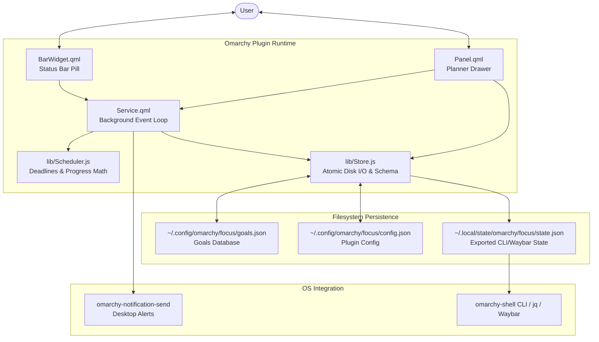

# Architecture & Technical Design 🏗️

This document outlines the architecture, component hierarchy, data flow, and runtime lifecycle of **Omarchy Daily Focus** (`daily.focus`).

---

## 📐 System Overview

`daily.focus` is designed as a lightweight, zero-telemetry, 100% offline desktop focus and goal tracking plugin for the Omarchy shell environment. It bridges desktop status-bar ergonomics with atomic file-based persistence.



---

## 🧩 Component Breakdown

### 1. `Service.qml` (Headless Event Daemon)
- **Lifecycle**: Initialized as a long-lived service background process by the Omarchy shell upon session startup.
- **Clock Engine**: Runs a 1,000ms periodic timer to calculate remaining deadline seconds, format countdowns, and check reminder thresholds.
- **Disk Watcher**: Runs a 10,000ms watcher checking for out-of-band file modifications in `goals.json` or `config.json` (such as direct edits made in text editors).
- **Suspend / Resume Detection**: Monitors monotonic clock jumps. If the clock delta exceeds 10 seconds between ticks, it identifies that the host machine was suspended or put to sleep, suppressing notification cascades and invoking the catch-up algorithm.
- **State Exporter**: Continuously syncs active targets, countdowns, and progress percentages to `~/.local/state/omarchy/focus/state.json` via atomic writes.

### 2. `BarWidget.qml` (Top Bar Pill)
- **Location**: Rendered within the center (or configured) section of the Omarchy top bar.
- **Visuals**:
  - **Left**: Active focus objective title and real-time ticking countdown (`MM:SS` or `HH:MM:SS`), color-coded green for active and red for overdue.
  - **Right**: Radial `ProgressRing` displaying the completed-to-total ratio (e.g. `5/8 DONE`).
- **Interactions**: Clicking the widget invokes `omarchy.togglePanel("daily.focus")` to slide open the planner drawer.

### 3. `Panel.qml` (Interactive Goal Planner)
- **View Hierarchy**:
  - **Header**: Title and quick close action.
  - **Summary Card**: Real-time progress ring and percentage calculation across today's targets.
  - **Quick Entry Form**: Input field with priority selector (`High`, `Normal`, `Low`) to schedule immediate tasks.
  - **Goal Backlog**: Scrollable `ListView` utilizing `GoalRow.qml` delegates with one-click completion toggles and delete capabilities.
- **Synchronization**: Any mutation in the UI updates the local list model and calls `Store.writeJsonAtomic()` to immediately flush changes to disk.

### 4. Reusable UI Components (`components/`)
- **`ProgressRing.qml`**: Canvas-based circular progress ring with configurable radius, stroke width, track color, and fill color.
- **`GoalRow.qml`**: Interactive row component featuring a custom checkbox, priority badge styling, strike-through completion styling, and delete action.

### 5. Pure Logic Modules (`lib/`)
- **`lib/Scheduler.js`**:
  - `findActiveTarget(dailyGoals, now)`: Identifies the current active goal based on scheduled start and deadline intervals.
  - `calculateCountdown(deadline, now, showSeconds)`: Generates structured countdown objects (`{ remainingSeconds, formatted, isOverdue }`).
  - `calculateProgress(dailyGoals, now)`: Returns completion counts, total targets, and percentage.
  - `detectMissedTargets(dailyGoals, sleepTime, wakeTime)`: Identifies deadlines that lapsed while the machine was asleep.
- **`lib/Store.js`**:
  - `writeJsonAtomic(filePath, data)`: Writes data to a temporary file (`.tmp`) before renaming it to the target file. This guarantees that crash or power-loss events never leave half-written JSON files.
  - `validateGoals(raw)`: Sanitizes input structures, sets missing fields, and enforces schema validity.
  - `resolvePath(filePath)`: Expands standard POSIX `~` home directory paths.

---

## 💾 Storage & Data Flow

| Path | Mode | Purpose |
| :--- | :--- | :--- |
| `~/.config/omarchy/focus/config.json` | Read / Write | Plugin configuration (reminder timings, bar modes, work hours). |
| `~/.config/omarchy/focus/goals.json` | Read / Write | Daily and weekly goals backlog. |
| `~/.local/state/omarchy/focus/state.json` | Write-only | Live runtime snapshot exported for external scripts and CLI tooling. |

### Atomic Write Pattern
```
[In-Memory Data] 
       │
       ▼
Write to "/path/to/file.json.tmp.<pid>"
       │
       ▼ fsync()
Rename (atomic replace) -> "/path/to/file.json"
```

---

## 🌙 Suspend / Resume Catch-Up Protocol

When a workstation is suspended, timers halt:

1. **System Wakes**: The next tick executes. `delta = currentTime - lastTickTime`.
2. **Detection**: If `delta > 10,000ms`, the system recognizes a wake event.
3. **Suppression**: Standard deadline alarms are suppressed to avoid an alert deluge.
4. **Aggregation**: Targets whose deadlines lapsed between `lastTickTime` and `currentTime` are tagged with `pendingReview: true`.
5. **Notification**: A single summary alert is dispatched: `X missed focus targets while away.`

---

## 🔒 Security & Privacy Invariants

- **Offline-Only**: Zero network sockets, HTTP requests, or external telemetry libraries.
- **Filesystem Confinement**: File operations are confined strictly to `~/.config/omarchy/focus/` and `~/.local/state/omarchy/focus/`.
- **System Stability**: Background threads use graceful fallbacks (`try/catch`) to ensure bar stability even under disk quota errors or missing configuration paths.
